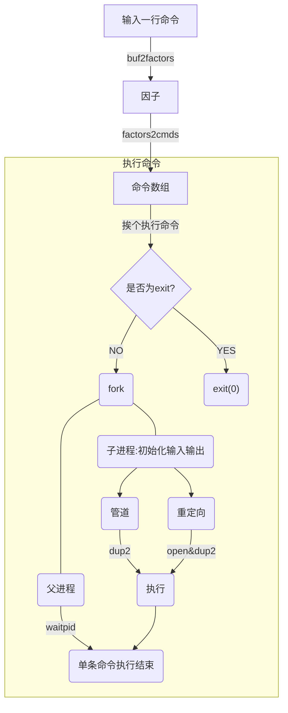

# 功能概述

本shell可以运行带参数的外部命令，支持标准I/O重定向，可以通过管道连接两个命令。另外也会显示当前文件路径，当命令出错时，返回`ERROR!`。输入`exit`程序退出。

使用方法：当前目录下`make`之后执行`./myshell`。

### 多参数支持

例如可以执行`grep -r main`

### 重定向

标准输出重定向：`>`

标准输出重定向（追加）：`>>`

标准输入重定向：`<`

混合使用：

### 管道

# 系统调用

### 函数

1. `int pipe(int fd[2])`：创建管道，其中`fd[0]`是一个文件描述符，为该指令的输入；`fd[1]`是一个文件描述符，保存该命令为后一条指令的输出。

2. `int open(const char *pathname, int oflag, [mode_t mode])`， 打开给定名称的文件，在本shell中以只读方式打开输入重定向的文件，以读写并创建的方式打开输出重定向的文件（若为输出附加重定向，则用读写并创建并附加的方式打开）

   `int close(int filedes)`，关闭给定的文件描述符的文件。

3. `int dup2(int filedes1, int filedes2)`，将文件描述符`filedes1`复制给`filedes2`，即让`filedes1`充当`filedes2`

4. `int execvp(cons char *filename, char *const argv[])`，执行给定文件，参数为`argv[]`，其中`argv[0]`为该命令字符名，`argv[1]`才是第一个参数。

5. `pid_t  waitpid(pid_t pid, int *statloc, int options)`，用于父进程等待子进程结束，并取走子进程状态，防止其成为僵死进程。

